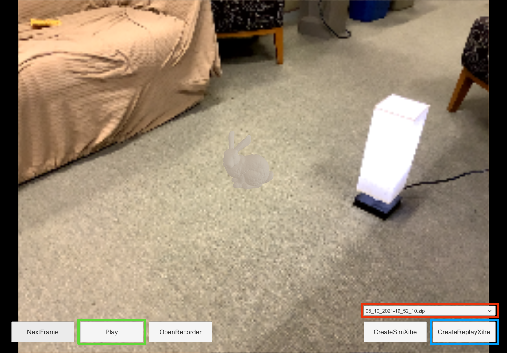

# Overview
This repo is a reference implementation of an AR app that is built with Xihe.
Note that we include the Xihe client APIs via the following files:

- `./Assets/Scripts/Xihe`: core framework components
- `./Assets/Resources/Shaders/PointCloudProcessing.compute`: on-device GPU pipeline
- `./Assets/Resources/Binary/grid_1024_512.bytes`: pre-generated acceleration grid

Below we first describe the basic steps to run the reference AR application on a Unity-compatible computer, followed by instructions to run on compatible iOS devices.

## Basic Setup

Before setting up the reference application, please make sure you have setup the [Xihe server](../server/) with a publicly-accessible network address.
Then, update the `Endpoint` constant (in `Assets/Scripts/Xihe/Network/HTTPSession.cs`) to point to the server address. Below is an example when we set the `Endpoint` to point to our lab's server.

```csharp
private const string Endpoint = "http://cake-graphics.dyn.wpi.edu:8550";
```

To setup the Xihe reference application, please first download the Unity3D version 2020.3.7f1 and load `reference-app` directory as a project.
Once the project finishes loading, use the Play button on the center top of Unity editor to start the AR application.

After the application starts, please follow the Unity editor's console log information to identify the appropriate Unity's application persistent data path. For example, below is a screenshot that shows the configured path in our MacBook.


You will need to copy all the AR session recordings (located at `data/recording` directory) to the path you identify above, e.g., using a terminal or through Finder.


## Normal Interactions

Now you should be all set to interact with the Xihe AR application. You can use the bottom right dropdown to select from three AR recordings, and press the `CreateReplayXihe` button.
There are two main buttons for evaluating Xihe's behaviors. The `Play` button allows the AR application to replay the selected recording normally while the `NextFrame` button runs Xihe in the debug mode with the triggering component disabled. Below is an example of the application's interface.




## Performance Measurements

System performance can be measured with the Unity profiler. Below is an example of using the profiler to measure the on-device GPU pipeline.


## iOS Deployment
To deploy the application to iOS device, first change the project build settings to `iOS` to generate an iOS project.
Then, compile and deploy the code to an iOS device.
Note that an Apple developer account is needed in order to sign the compiled iOS application during deployment.
